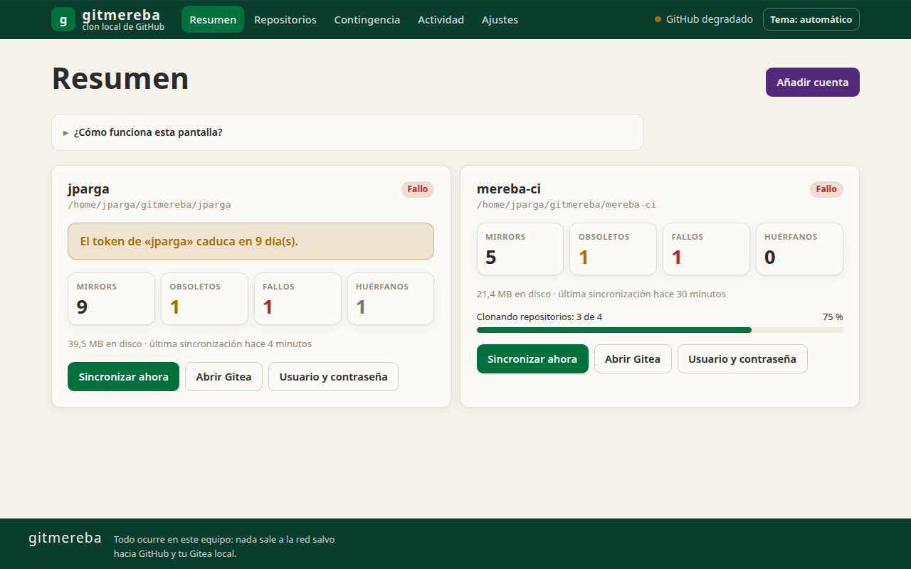
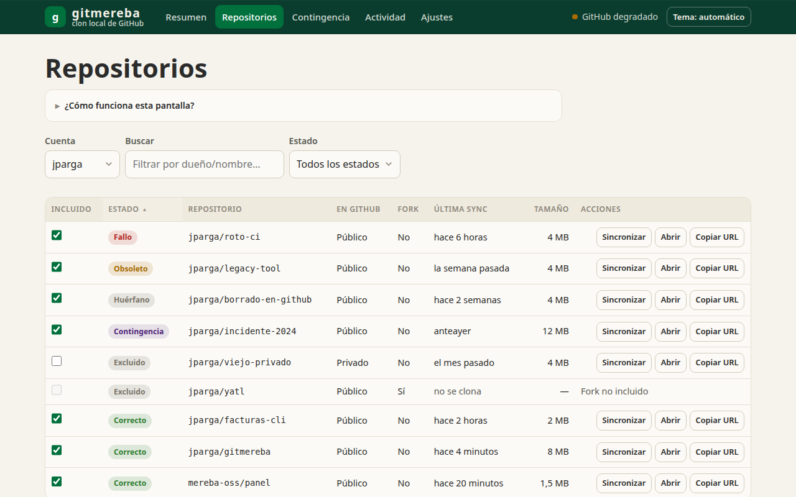
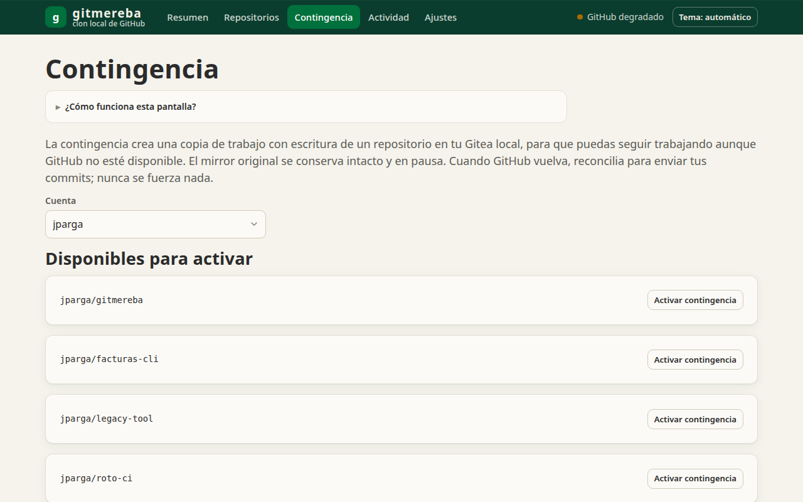
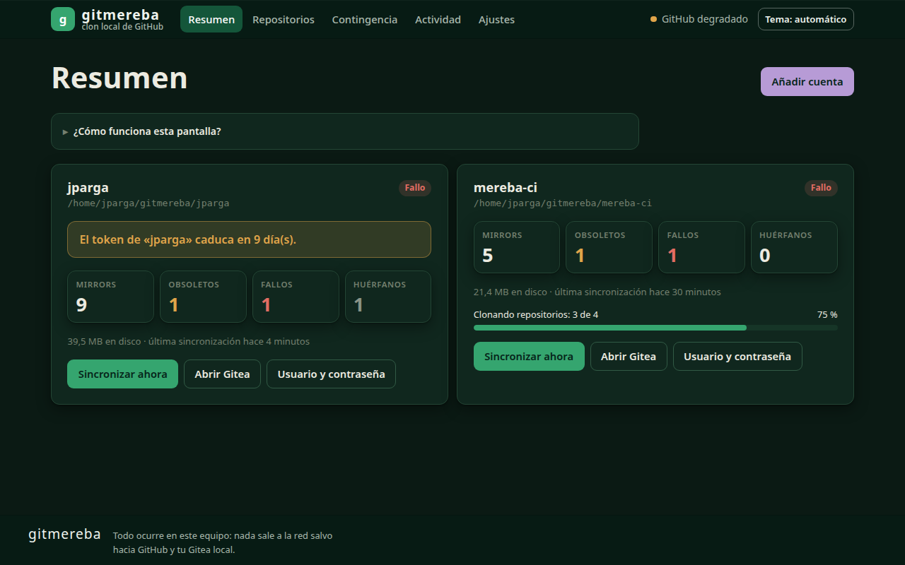

[English](README.md) · **Español**

# gitmereba

Mantén un clon local y operativo de tus cuentas de GitHub sobre un Gitea nativo, y sigue haciendo `push` cuando GitHub cae.

[](https://github.com/jparga/gitmereba/actions/workflows/ci.yml)




<p>
  
  
  
</p>

## Qué es y para qué

gitmereba es una app de escritorio para Linux escrita en Rust. Con un usuario de GitHub, un
token de solo lectura y una carpeta, levanta en tu equipo un Gitea por cuenta (nativo, sin
Docker) y mantiene en él copias espejo de tus repositorios, sincronizadas periódicamente
incluso con la ventana cerrada.

No es solo una copia de seguridad. Si GitHub cae, puedes pasar un repositorio a una copia con
escritura, hacer `git push` a tu Gitea local y seguir trabajando. Cuando GitHub vuelve,
gitmereba reconcilia esos cambios con GitHub. Nunca fuerza el envío: si GitHub recibió otros
cambios entretanto, se detiene y te avisa para que los integres tú.

## Funciones

- Un Gitea local independiente por cuenta, aprovisionado por la app; admite varias cuentas.
- Sincronización periódica con un temporizador `systemd --user` y notificaciones de escritorio
  cuando algo falla.
- Estado por repositorio (al día, obsoleto, fallo, huérfano, contingencia, excluido) y
  selección de qué incluir.
- Modo contingencia: copia con escritura mientras GitHub está caído y reconciliación sin forzar.
- Capturas de ramas y etiquetas antes de cada sincronización: si en GitHub se reescribe o borra
  historia, se puede recuperar (las 10 últimas capturas y todas las de los últimos 30 días).
- Los huérfanos (repos borrados en GitHub) se conservan en pausa; nada se borra solo.
- Acceso opcional desde tu red local por HTTPS, con usuarios restringidos de Gitea por persona
  (lectura en los mirrors, escritura solo en los repos de contingencia).
- Orden `doctor`, que comprueba el sistema y cada cuenta.
- Ventana Tauri 2 y CLI completa; interfaz en HTML/CSS/JS estático, sin Node, sin bundler, sin CDN.

## Modelo de seguridad

La seguridad es la prioridad nº 1 del proyecto. En concreto:

- **Secretos solo en el llavero del sistema.** El token de GitHub y la contraseña y el token de
  Gitea viven en el llavero Secret Service (GNOME Keyring o KWallet), nunca en ficheros,
  registros, mensajes de error ni argumentos de proceso. Se manejan con un tipo `Secreto` sin
  `Display`, con un `Debug` que no muestra el contenido y que se borra de memoria al soltarse. Ninguna URL lleva credenciales.
- **Token de solo lectura.** Sincronizar solo necesita *Contents: Read* y *Metadata: Read*. Un
  token con escritura se pide únicamente al reconciliar una contingencia, se usa para ese envío
  y no se guarda.
- **Sin shell.** `git` y `gitea` se invocan con listas de argumentos y nombres validados.
- **Binario de Gitea verificado.** Se descarga de su web oficial y se comprueban el SHA-256
  fijado y la firma GPG (clave embebida en la app) antes de usarlo.
- **Gitea endurecido.** Por defecto escucha solo en `127.0.0.1`; registro, acceso anónimo,
  OpenID, Actions, paquetes, servidor SSH y comprobación de actualizaciones desactivados; los
  webhooks solo pueden apuntar a loopback. Las copias locales son siempre privadas.
- **HTTPS local para la LAN.** Apagado por defecto; al activarlo es solo HTTPS (TLS 1.2+) con
  certificado autofirmado cuya huella SHA-256 muestra la app para comprobarla por otro canal.
  Nunca se sugiere desactivar la verificación del certificado. Gitea pasa a escuchar en todas
  las interfaces y `doctor` avisa si no hay cortafuegos activo.
- **Auditoría de solo añadir y encadenada.** La pantalla Actividad indica si está íntegra.
- **Ficheros y unidades.** Carpetas de cuenta 0700 y ficheros de configuración 0600. Las
  unidades systemd aplican seccomp y otro endurecimiento.
- **Código.** `unsafe` prohibido en el workspace; sin `unwrap`/`expect` fuera de tests; TLS con
  rustls; `cargo deny` y `cargo audit` forman parte de `scripts/verificar.sh` y de la CI.
- **Tauri.** CSP estricta, sin contenido remoto, capacidades mínimas, sin plugin de shell.

### Limitaciones conocidas

- En Ubuntu, AppArmor hace que `systemd --user` ignore en silencio las directivas basadas en
  espacios de nombres (`ProtectSystem`, `ProtectHome`, `PrivateTmp`…); solo se aplican las de
  seccomp/prctl. `gitmereba doctor` informa de qué está activo.
- Con el acceso LAN activo, Gitea escucha en todas las interfaces (también VPN o Wi-Fi
  ajenas). Usa una regla de cortafuegos limitada a tu subred; `doctor` te sugiere una.
- Las copias de contingencia no llevan los objetos de Git LFS si `git-lfs` no está instalado.
- Hace falta una sesión de escritorio con Secret Service; no funciona en servidores sin
  escritorio.

## Comparación

| | gitmereba | Herramientas de mirror autoalojadas (p. ej. gitea-mirror, gickup) | Servicios de backup alojados (p. ej. Rewind, BackHub) |
|---|---|---|---|
| Dónde corre | App de escritorio + CLI en tu Linux | Normalmente un servidor, interfaz web o CLI, a menudo con Docker | Nube del proveedor |
| Hosts | Solo GitHub | gitea-mirror: GitHub a Gitea; gickup: muchos hosts Git | Según proveedor |
| Trabajar durante una caída | Sí: copia con escritura y reconciliación sin forzar | Depende de la herramienta | En general orientados a restaurar |
| Dónde están los datos | Tu equipo | Tu servidor | El proveedor |

gitmereba **no** es multi-host, **no** es multiplataforma (solo Linux), **no** es un SaaS y no
es un servidor para equipos. Si necesitas eso, las otras opciones lo hacen bien. (Comparación
basada en la descripción pública de cada proyecto; consulta su documentación.)

## Instalación

Descarga el `.deb` de [Releases](https://github.com/jparga/gitmereba/releases) e instálalo:

```bash
sudo apt install ./gitmereba_<versión>_amd64.deb
```

Cada versión incluye un fichero `SHA256SUMS` y una atestación de procedencia del build, para
que compruebes que el paquete se generó desde este repositorio:

```bash
sha256sum -c SHA256SUMS --ignore-missing
gh attestation verify gitmereba_<versión>_amd64.deb --repo jparga/gitmereba
```

Necesitas Linux con escritorio (probado en Ubuntu 24.04) y un llavero activo (GNOME Keyring o
KWallet), además de un token fine-grained de GitHub con *Contents: Read* y *Metadata: Read*.
Para compilar desde el código o instalar sin permisos de administrador, consulta
[`docs/compilar.md`](docs/compilar.md).

## Primeros pasos

Ventana: ejecuta `gitmereba` sin argumentos y pulsa *Añadir cuenta*. CLI:

```bash
gitmereba cuenta add --login <usuario> --carpeta <ruta>   # pide el token sin mostrarlo
gitmereba cuenta list
gitmereba sync <usuario>               # o: gitmereba sync --todas [--simulacro]
gitmereba status [--json]
gitmereba doctor
gitmereba cuenta lan --login <usuario> --activar    # acceso LAN opcional (--desactivar, --estado)
gitmereba cuenta usuario --login <usuario> --crear <nombre>   # usuario LAN (--eliminar, --listar)
gitmereba cuenta rm <usuario>          # no borra los repositorios
```

## Documentación

- [`docs/manual.md`](docs/manual.md): manual de usuario (español); [`docs/manual.en.md`](docs/manual.en.md) es la versión en inglés
- [`docs/compilar.md`](docs/compilar.md): compilar, empaquetar e instalar desde el código
- [`CHANGELOG.md`](CHANGELOG.md): cambios de cada versión

## Idioma

La ventana, la ayuda integrada, la ayuda y los mensajes de la CLI y el manual están en
**español e inglés**. El idioma sigue al sistema (`LC_ALL`, `LC_MESSAGES`, `LANG`; inglés si
no hay ninguno) y se cambia en Ajustes. Los subcomandos y las opciones de la CLI están en
español. Se agradecen contribuciones, también traducciones.

## Estado

Pre-1.0 (versión 0.7.1), en uso diario por el autor. Espera cambios. Ver
[`CHANGELOG.md`](CHANGELOG.md).

## Contribuir, seguridad, conducta

- [`CONTRIBUTING.md`](CONTRIBUTING.md)
- Seguridad: comunica las vulnerabilidades en privado mediante GitHub Security Advisories,
  nunca en issues públicas. Ver [`SECURITY.md`](SECURITY.md).
- [`CODE_OF_CONDUCT.md`](CODE_OF_CONDUCT.md)

## Licencia

GPL-3.0-or-later, ver [`LICENSE`](LICENSE). El nombre y el logotipo MEREBA son marcas; ver
[`TRADEMARKS.md`](TRADEMARKS.md).

Autor: Jacinto Parga, [MEREBA](https://mereba.com). Pronto habrá una página del proyecto en mereba.com.
