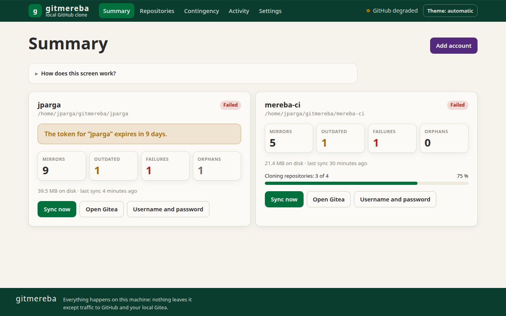
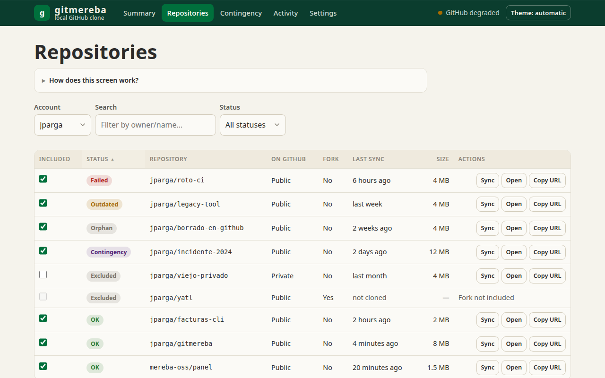
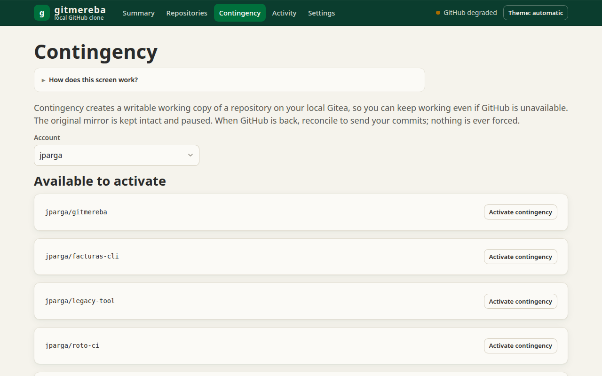
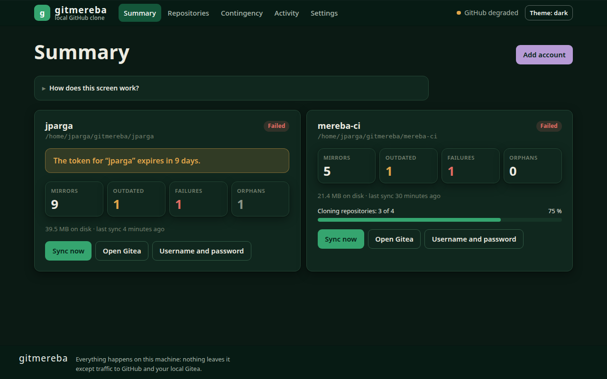

**English** · [Español](README.es.md)

# gitmereba

Keep a local, working clone of your GitHub accounts on a native Gitea, and keep pushing when GitHub is down.

[](https://github.com/jparga/gitmereba/actions/workflows/ci.yml)




<p>
  
  
  
</p>

## What it is and why

gitmereba is a Linux desktop app written in Rust. Given a GitHub user, a read-only token and a
folder, it runs a Gitea instance per account on your machine (native, no Docker) and keeps
mirrors of your repositories in it, synchronised periodically, even when the window is closed.

It is not only a backup. If GitHub goes down you can switch a repository to a writable copy,
`git push` to your local Gitea and carry on working. When GitHub is back, gitmereba
reconciles those changes to GitHub. It never force-pushes: if GitHub received other changes in
the meantime, it stops and tells you so you can merge them yourself.

## Features

- One independent local Gitea per account, provisioned for you; several accounts supported.
- Periodic sync through a `systemd --user` timer, with desktop notifications on failure.
- Per-repository status (up to date, stale, failed, orphan, contingency, excluded) and
  include/exclude selection.
- Contingency mode: writable copy while GitHub is down, then non-forced reconciliation.
- Snapshots of branches and tags before every sync, so rewritten or deleted history on GitHub
  can be recovered (last 10 snapshots plus everything from the last 30 days).
- Orphans (repositories deleted on GitHub) are kept paused; nothing is deleted automatically.
- Optional sharing on your LAN over HTTPS, with per-person restricted Gitea users
  (read on mirrors, write only on contingency repositories).
- `doctor` command that checks the system and every account.
- Tauri 2 window plus a full CLI; static HTML/CSS/JS UI, no Node, no bundler, no CDN.

## Security model

Security is the project's first priority. Specifically:

- **Secrets only in the system keyring.** GitHub token, Gitea password and Gitea token live in
  the Secret Service keyring (GNOME Keyring or KWallet), never in files, logs, error messages
  or process arguments. They are held in a `Secreto` type that has no `Display`, redacts itself
  in `Debug` and is wiped from memory when dropped. URLs never embed credentials.
- **Read-only token.** Sync needs only *Contents: Read* and *Metadata: Read*. A token with write
  access is requested only when you reconcile a contingency, used for that push and not stored.
- **No shell.** `git` and `gitea` are run with argument lists and validated names.
- **Verified Gitea binary.** Gitea is downloaded from its official site and checked against a
  pinned SHA-256 and its GPG signature (key embedded in the app) before use.
- **Hardened Gitea.** Listens only on `127.0.0.1` by default; registration, anonymous access,
  OpenID, Actions, packages, SSH server and update checks are disabled; webhooks may only
  target loopback. Mirrors are always private locally.
- **Local HTTPS for the LAN.** Sharing is off by default; when enabled it is HTTPS only
  (TLS 1.2+) with a self-signed certificate whose SHA-256 fingerprint the app shows so you can
  verify it out of band. The app never suggests disabling certificate verification. Gitea
  then listens on all interfaces, and `doctor` warns if no firewall is active.
- **Append-only, hash-chained audit log.** The Activity screen tells you whether it is intact.
- **Files and units.** Account folders are 0700 and config files 0600. The systemd units use
  seccomp and related hardening.
- **Code.** `unsafe` is forbidden in the workspace; no `unwrap`/`expect` outside tests; TLS via
  rustls; `cargo deny` and `cargo audit` run as part of `scripts/verificar.sh` and CI.
- **Tauri.** Strict CSP, no remote content, minimal capabilities, no shell plugin.

### Known limitations

- On Ubuntu, AppArmor makes `systemd --user` silently ignore namespace-based directives
  (`ProtectSystem`, `ProtectHome`, `PrivateTmp`…); only the seccomp/prctl ones apply.
  `gitmereba doctor` reports what is active.
- With LAN sharing on, Gitea listens on all interfaces (including VPN or foreign Wi-Fi).
  Use a firewall rule limited to your subnet; `doctor` suggests one.
- Contingency copies do not carry Git LFS objects unless `git-lfs` is installed.
- A desktop session with Secret Service is required; headless servers are not supported.

## How it compares

| | gitmereba | Self-hosted mirror tools (e.g. gitea-mirror, gickup) | Hosted backup services (e.g. Rewind, BackHub) |
|---|---|---|---|
| Runs | Desktop app + CLI on your Linux machine | Typically a server, web UI or CLI, often Docker | Vendor's cloud |
| Hosts | GitHub only | gitea-mirror: GitHub to Gitea; gickup: many Git hosts | Vendor-specific |
| Work during an outage | Yes: writable copy, then non-forced reconcile | Depends on the tool | Generally restore-oriented |
| Data location | Your machine | Your server | Vendor |

gitmereba is **not** multi-host, **not** cross-platform (Linux only), **not** a SaaS and not a
team server. Pick the other tools if you need those things; they are good at them.
(Comparison based on each project's public description; check their docs for details.)

## Installation

Download the `.deb` from [Releases](https://github.com/jparga/gitmereba/releases) and install it:

```bash
sudo apt install ./gitmereba_<version>_amd64.deb
```

Each release ships a `SHA256SUMS` file and a build provenance attestation, so you can check
that the package was built from this repository:

```bash
sha256sum -c SHA256SUMS --ignore-missing
gh attestation verify gitmereba_<version>_amd64.deb --repo jparga/gitmereba
```

You need a Linux desktop (tested on Ubuntu 24.04) with an active keyring (GNOME Keyring or
KWallet), and a fine-grained GitHub token with *Contents: Read* and *Metadata: Read*.
To build from source or install without root, see [`docs/compilar.md`](docs/compilar.md).

## Quick start

Window: run `gitmereba` with no arguments and press *Add account*. CLI (the subcommands and flags are in Spanish):

```bash
gitmereba cuenta add --login <user> --carpeta <path>   # asks for the token without echoing it
gitmereba cuenta list
gitmereba sync <user>                  # or: gitmereba sync --todas [--simulacro]
gitmereba status [--json]
gitmereba doctor
gitmereba cuenta lan --login <user> --activar    # optional LAN sharing (--desactivar, --estado)
gitmereba cuenta usuario --login <user> --crear <name>   # LAN user (--eliminar, --listar)
gitmereba cuenta rm <user>             # does not delete the repositories
```

## Documentation

- [`docs/manual.en.md`](docs/manual.en.md): user manual (English); [`docs/manual.md`](docs/manual.md) is the Spanish version
- [`docs/compilar.md`](docs/compilar.md): building, packaging and installing from source
- [`CHANGELOG.md`](CHANGELOG.md): what changed in each version

## Language

The app window, the built-in help, the CLI help and messages, and the manual are available in
**English and Spanish**. The language follows your system (`LC_ALL`, `LC_MESSAGES`, `LANG`;
English if none is set) and can be changed in Settings. The CLI subcommands and flags are in
Spanish. Contributions, including translations, are welcome.

## Status

Pre-1.0 (version 0.8.0), used daily by the author. Expect changes. See
[`CHANGELOG.md`](CHANGELOG.md).

## Contributing, security, conduct

- [`CONTRIBUTING.md`](CONTRIBUTING.md)
- Security: report vulnerabilities privately through GitHub Security Advisories, never in public
  issues. See [`SECURITY.md`](SECURITY.md).
- [`CODE_OF_CONDUCT.md`](CODE_OF_CONDUCT.md)

## License

GPL-3.0-or-later, see [`LICENSE`](LICENSE). The MEREBA name and logo are trademarks; see
[`TRADEMARKS.md`](TRADEMARKS.md).

Author: Jacinto Parga, [MEREBA](https://mereba.com). A project page on mereba.com is coming.
